# ARMGUARD - System Architecture

## Table of Contents
- [Architecture Overview](#architecture-overview)
- [System Components](#system-components)
- [Frontend Architecture](#frontend-architecture)
- [Backend Architecture](#backend-architecture)
- [Database Design](#database-design)
- [API Architecture](#api-architecture)
- [Real-time Communication](#real-time-communication)
- [Security Architecture](#security-architecture)
- [Network Architecture](#network-architecture)
- [Deployment Architecture](#deployment-architecture)
- [Scalability Considerations](#scalability-considerations)
- [Performance Architecture](#performance-architecture)

## Architecture Overview

ARMGUARD follows a modern **n-tier architecture** designed for military-grade security, reliability, and performance. The system implements a **layered security model** with **network-based access controls** and **comprehensive audit logging**.

### Architectural Patterns
- **Model-View-Controller (MVC)**: Django's MVT pattern for clean separation of concerns
- **Service-Oriented Architecture**: Modular app structure with dedicated services
- **Event-Driven Architecture**: Real-time updates via WebSocket events
- **Repository Pattern**: Database abstraction with custom managers
- **Middleware Pattern**: Request/response processing pipeline

### Design Principles
1. **Security First**: Every component designed with security as primary concern
2. **Fail-Safe Operation**: Graceful degradation and error handling
3. **Audit Transparency**: Complete activity tracking and logging
4. **Network Isolation**: LAN-only sensitive operations
5. **Modular Design**: Loosely coupled, highly cohesive components

## System Components

### High-Level Architecture Diagram

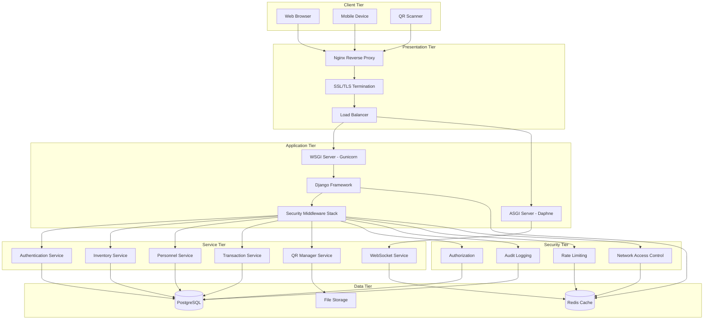

### Component Responsibilities

#### Client Tier Components
- **Web Browser**: Primary user interface for desktop/laptop access
- **Mobile Device**: Touch-optimized interface for mobile access
- **QR Scanner**: Camera-based QR code scanning functionality

#### Presentation Tier Components
- **Nginx**: Reverse proxy, static file serving, SSL termination
- **Load Balancer**: Traffic distribution and high availability
- **SSL/TLS**: Encryption for all communications

#### Application Tier Components
- **Django Framework**: Core web application framework
- **WSGI Server (Gunicorn)**: HTTP request handling for Django
- **ASGI Server (Daphne)**: WebSocket and async request handling
- **Middleware Stack**: Request/response processing pipeline

#### Service Tier Components
- **Authentication Service**: User login, session management
- **Inventory Service**: Weapons and equipment management
- **Personnel Service**: Military personnel management
- **Transaction Service**: Weapon withdrawal/return processing
- **QR Manager Service**: QR code generation and management
- **WebSocket Service**: Real-time communication handling

## Frontend Architecture

### Client-Side Architecture

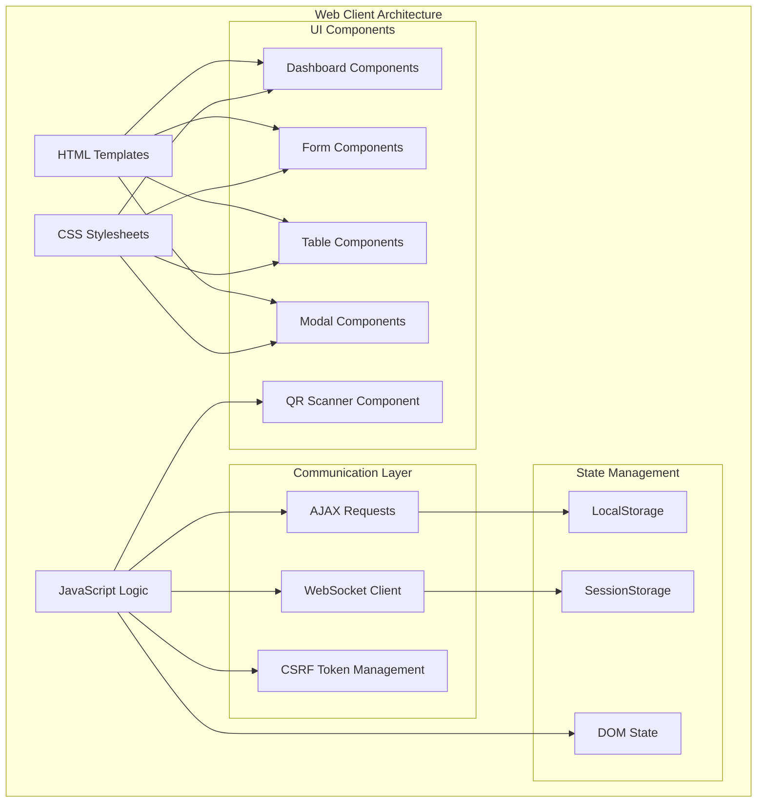

### Frontend Technology Stack
- **Template Engine**: Django Templates with template inheritance
- **CSS Framework**: Bootstrap 5.3 with custom military theme
- **JavaScript**: Vanilla ES6+ with WebSocket API
- **Icons**: FontAwesome 6.0 professional icon set
- **QR Scanner**: HTML5 Camera API with qrcode.js library
- **Charts/Graphs**: Chart.js for dashboard analytics
- **Progressive Web App**: Service worker for offline capability

### Responsive Design Architecture
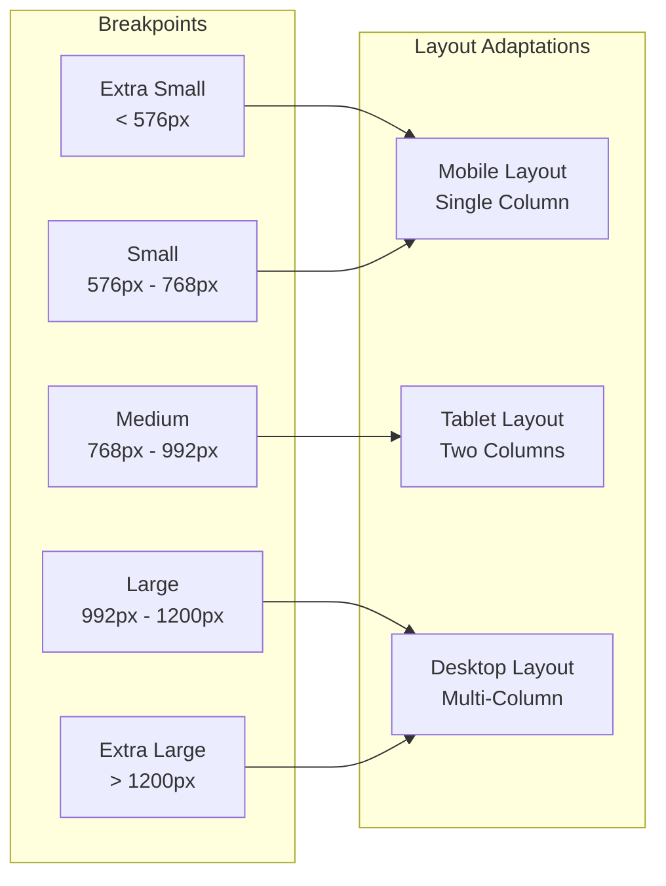

## Backend Architecture

### Django Application Structure

```mermaid
graph TB
    subgraph "Django Project: core"
        SETTINGS[Settings]
        URLS[URL Configuration]
        WSGI[WSGI Configuration]
        ASGI[ASGI Configuration]
    end
    
    subgraph "Django Apps"
        ADMIN_APP[admin - System Administration]
        CORE_APP[core - Core Functionality]
        USERS_APP[users - User Management]
        PERSONNEL_APP[personnel - Personnel Management]
        INVENTORY_APP[inventory - Inventory Management]
        TRANSACTIONS_APP[transactions - Transaction Processing]
        QR_MANAGER_APP[qr_manager - QR Code Management]
        PRINT_HANDLER_APP[print_handler - Document Generation]
        VPN_INTEGRATION_APP[vpn_integration - VPN Support]
    end
    
    subgraph "Shared Components"
        MIDDLEWARE[Custom Middleware]
        VALIDATORS[Data Validators]
        UTILITIES[Utility Functions]
        TEMPLATES[Template System]
        STATIC[Static Files]
    end
    
    CORE_APP --> SETTINGS
    CORE_APP --> URLS
    CORE_APP --> WSGI
    CORE_APP --> ASGI
    
    ADMIN_APP --> MIDDLEWARE
    USERS_APP --> MIDDLEWARE
    PERSONNEL_APP --> MIDDLEWARE
    INVENTORY_APP --> MIDDLEWARE
    TRANSACTIONS_APP --> MIDDLEWARE
    QR_MANAGER_APP --> MIDDLEWARE
    PRINT_HANDLER_APP --> MIDDLEWARE
    VPN_INTEGRATION_APP --> MIDDLEWARE
    
    MIDDLEWARE --> VALIDATORS
    MIDDLEWARE --> UTILITIES
    MIDDLEWARE --> TEMPLATES
    MIDDLEWARE --> STATIC
```

### Application Module Details

#### Core Application Structure
```python
core/
├── __init__.py
├── settings.py              # Django settings with security optimizations
├── urls.py                  # Main URL configuration
├── wsgi.py                  # WSGI server configuration
├── asgi.py                  # ASGI server configuration for WebSockets
├── middleware/              # Custom middleware components
│   ├── security_middleware.py
│   ├── audit_middleware.py
│   ├── network_middleware.py
│   └── performance.py
├── templates/               # Base templates
├── static/                  # Static assets
├── views.py                 # Core views (dashboard, login)
├── utils.py                 # Utility functions
├── validator.py             # Data validation
└── network_decorators.py    # Network access decorators
```

#### Service-Oriented Module Architecture
Each Django app follows consistent structure:

```python
app_name/
├── __init__.py
├── models.py               # Data models with audit logging
├── views.py                # Class-based and function-based views
├── urls.py                 # URL routing for the app
├── forms.py                # Form definitions and validation
├── admin.py                # Django admin configuration
├── signals.py              # Django signal handlers
├── apps.py                 # App configuration
├── migrations/             # Database migrations
├── templates/app_name/     # App-specific templates
├── static/app_name/        # App-specific static files
└── tests.py                # Unit and integration tests
```

### Request Processing Pipeline

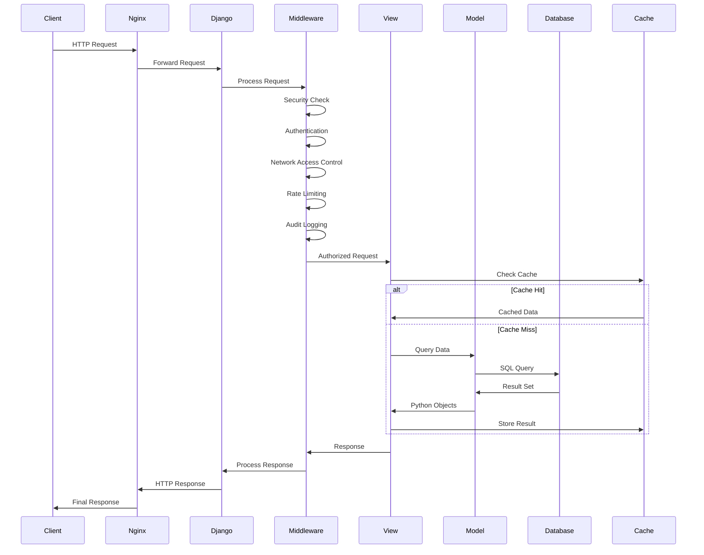

## Database Design

### Entity Relationship Diagram

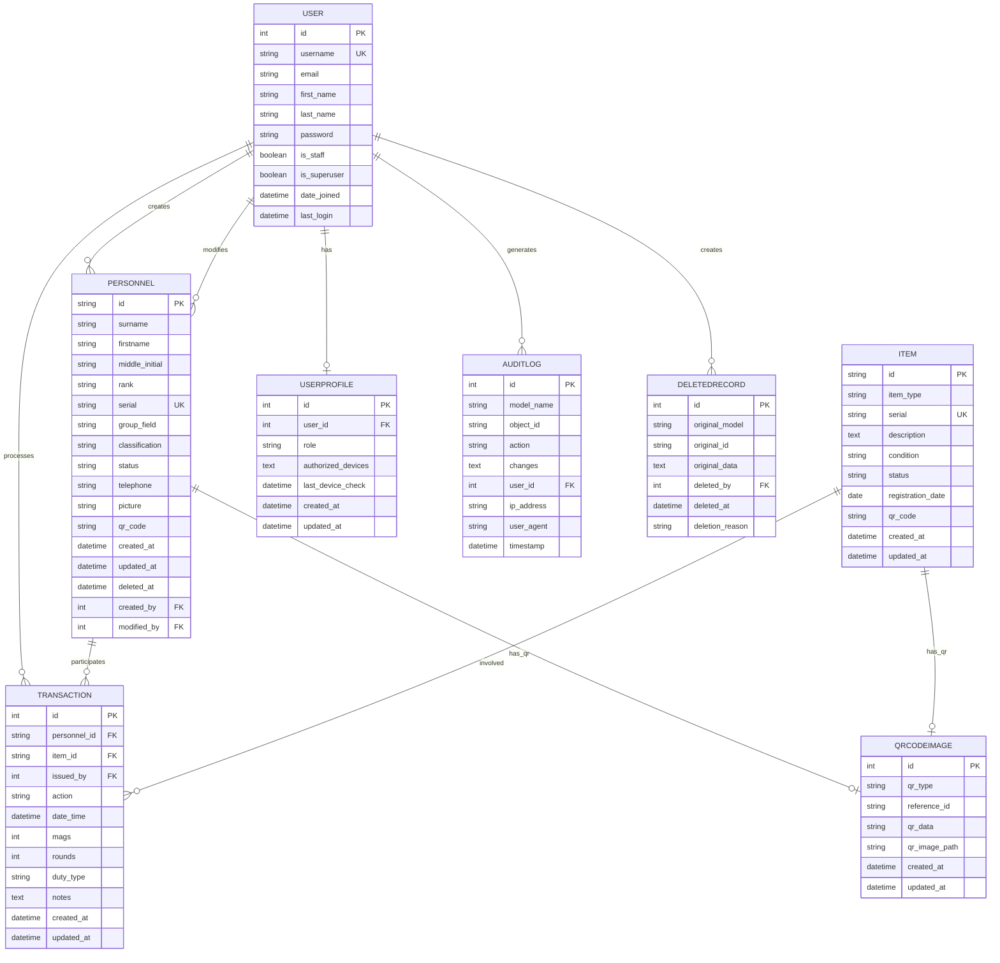

### Database Optimization Features

#### Indexing Strategy
```sql
-- Personnel table indexes
CREATE INDEX idx_personnel_status_group ON personnel(status, group_field);
CREATE INDEX idx_personnel_serial ON personnel(serial);
CREATE INDEX idx_personnel_deleted_at ON personnel(deleted_at);

-- Item table indexes  
CREATE INDEX idx_item_type_status ON items(item_type, status);
CREATE INDEX idx_item_serial ON items(serial);

-- Transaction table indexes
CREATE INDEX idx_transaction_date_time ON transactions(date_time DESC);
CREATE INDEX idx_transaction_personnel_date ON transactions(personnel_id, date_time DESC);
CREATE INDEX idx_transaction_item_date ON transactions(item_id, date_time DESC);

-- Audit log indexes
CREATE INDEX idx_auditlog_timestamp ON admin_auditlog(timestamp DESC);
CREATE INDEX idx_auditlog_model_object ON admin_auditlog(model_name, object_id);
CREATE INDEX idx_auditlog_user_timestamp ON admin_auditlog(user_id, timestamp DESC);
```

#### Query Optimization Features
- **Select Related**: Automatic foreign key optimization
- **Prefetch Related**: Optimized M2M and reverse FK queries
- **Database Query Caching**: Redis-based query result caching
- **Connection Pooling**: PostgreSQL connection reuse
- **Read Replicas**: Support for read-only database replicas

## API Architecture

### RESTful API Design

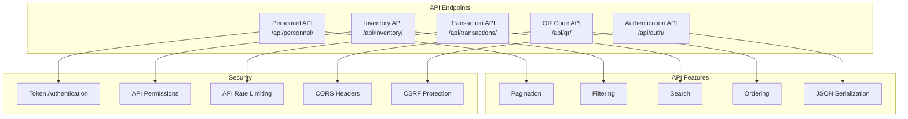

### API Endpoint Structure

#### Personnel Management API
```python
# URL: /api/personnel/
GET     /api/personnel/              # List all personnel
POST    /api/personnel/              # Create new personnel
GET     /api/personnel/{id}/         # Get specific personnel
PUT     /api/personnel/{id}/         # Update personnel
PATCH   /api/personnel/{id}/         # Partial update
DELETE  /api/personnel/{id}/         # Soft delete personnel

# Additional endpoints
GET     /api/personnel/search/       # Search personnel
GET     /api/personnel/by-qr/        # Lookup by QR code
POST    /api/personnel/bulk/         # Bulk operations
```

#### Inventory Management API
```python
# URL: /api/inventory/
GET     /api/inventory/              # List all items
POST    /api/inventory/              # Register new item
GET     /api/inventory/{id}/         # Get specific item
PUT     /api/inventory/{id}/         # Update item
PATCH   /api/inventory/{id}/         # Partial update
DELETE  /api/inventory/{id}/         # Remove item

# Status management
PATCH   /api/inventory/{id}/status/  # Update item status
GET     /api/inventory/available/    # Available items only
GET     /api/inventory/issued/       # Issued items only
```

#### Transaction Processing API
```python
# URL: /api/transactions/
GET     /api/transactions/           # List transactions
POST    /api/transactions/           # Create transaction
GET     /api/transactions/{id}/      # Get transaction details
POST    /api/transactions/qr/        # QR-based transaction
POST    /api/transactions/return/    # Process return

# Reporting endpoints
GET     /api/transactions/report/    # Generate reports
GET     /api/transactions/audit/     # Audit trail
```

### API Response Format

#### Standard Success Response
```json
{
  "success": true,
  "data": {
    "id": "PE-12345678-090226",
    "surname": "Smith",
    "firstname": "John",
    "rank": "SGT",
    "status": "Active"
  },
  "meta": {
    "timestamp": "2026-02-09T10:30:00Z",
    "version": "1.0"
  }
}
```

#### Standard Error Response
```json
{
  "success": false,
  "error": {
    "code": "VALIDATION_ERROR",
    "message": "Invalid data provided",
    "details": {
      "serial": ["This serial number is already in use"],
      "rank": ["Invalid rank specified"]
    }
  },
  "meta": {
    "timestamp": "2026-02-09T10:30:00Z",
    "version": "1.0"
  }
}
```

#### Paginated Response
```json
{
  "success": true,
  "data": [...],
  "pagination": {
    "page": 1,
    "per_page": 25,
    "total_pages": 4,
    "total_count": 87,
    "has_next": true,
    "has_prev": false
  }
}
```

## Real-time Communication

### WebSocket Architecture

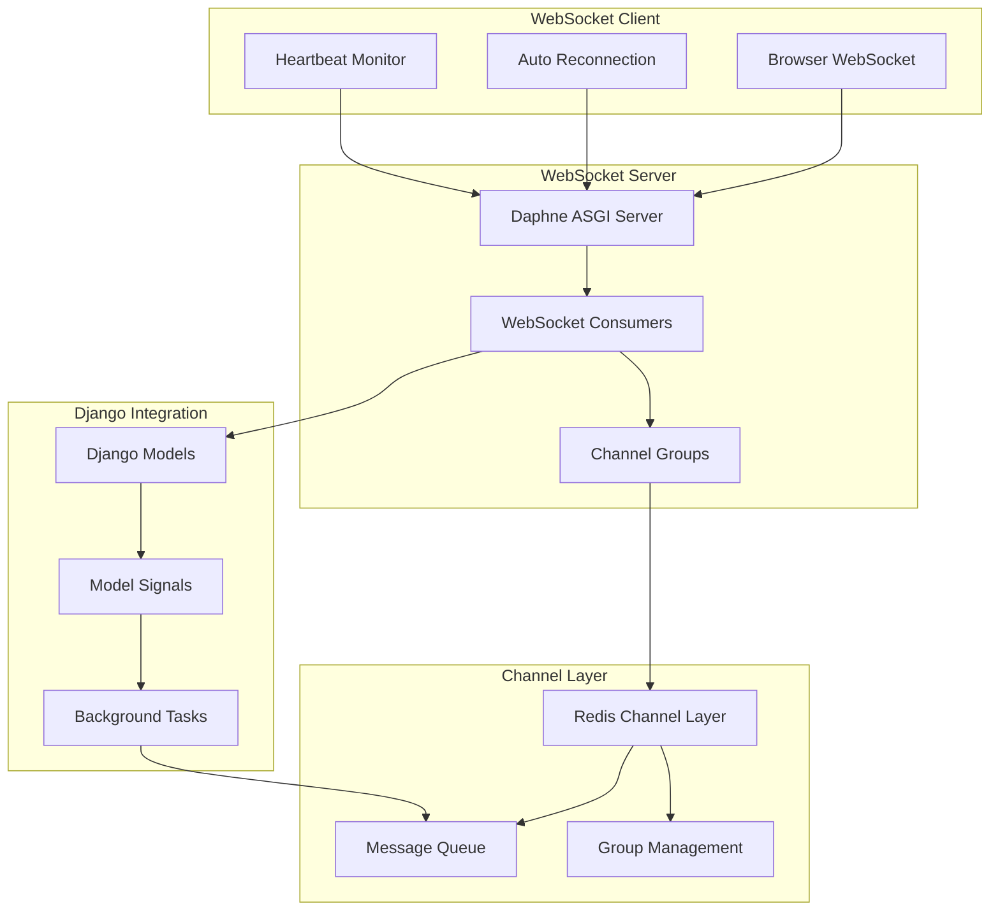

### WebSocket Event Types

#### Dashboard Events
```javascript
// Real-time dashboard updates
{
  "type": "dashboard.update",
  "data": {
    "personnel_count": 45,
    "available_items": 23,
    "issued_items": 12,
    "recent_transactions": [...]
  }
}

// Transaction notifications
{
  "type": "transaction.created",
  "data": {
    "id": 123,
    "personnel": "SGT Smith",
    "item": "M16-001",
    "action": "Take",
    "timestamp": "2026-02-09T10:30:00Z"
  }
}
```

#### System Alerts
```javascript
// Security alerts
{
  "type": "security.alert",
  "data": {
    "level": "warning",
    "message": "Multiple failed login attempts detected",
    "ip_address": "192.168.1.100",
    "timestamp": "2026-02-09T10:30:00Z"
  }
}

// System status updates
{
  "type": "system.status",
  "data": {
    "database": "connected",
    "redis": "connected",
    "users_online": 3
  }
}
```

### Connection Management

#### Connection Lifecycle
1. **Connection Establishment**: WebSocket handshake with authentication
2. **Group Assignment**: User joined to relevant channel groups
3. **Heartbeat Monitoring**: Periodic ping/pong for connection health
4. **Message Broadcasting**: Real-time event distribution
5. **Graceful Disconnection**: Clean connection termination

#### Connection Security
```python
# WebSocket authentication middleware
class WebSocketAuthMiddleware:
    def __init__(self, app):
        self.app = app
    
    async def __call__(self, scope, receive, send):
        # Authenticate WebSocket connection
        user = await self.authenticate_websocket(scope)
        if user:
            scope['user'] = user
            return await self.app(scope, receive, send)
        else:
            await send({'type': 'websocket.close', 'code': 4001})
```

## Security Architecture

### Multi-Layer Security Model

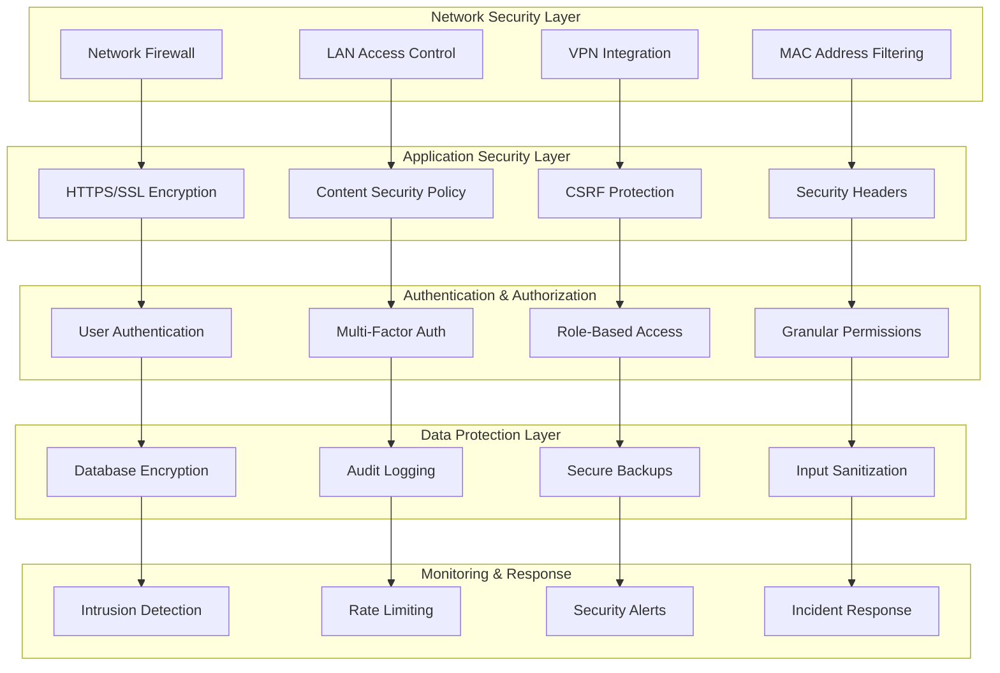

### Security Implementation Details

#### Network-Based Access Control
```python
# LAN/WAN access control decorator
@lan_required
@user_passes_test(is_admin_or_armorer)
def qr_transaction_scanner(request):
    """QR Scanner - Admin/Armorer + LAN access only"""
    return render(request, 'transactions/qr_scanner.html')

# Network middleware implementation
class NetworkBasedAccessMiddleware:
    def __init__(self, get_response):
        self.get_response = get_response
    
    def __call__(self, request):
        if self.is_lan_only_path(request.path):
            if not self.is_lan_access(request):
                return HttpResponseForbidden("LAN access required")
        
        return self.get_response(request)
```

#### Role-Based Permissions
```python
# Permission matrix
ROLE_PERMISSIONS = {
    'Admin': [
        'personnel.add', 'personnel.change', 'personnel.delete',
        'inventory.add', 'inventory.change', 'inventory.delete',
        'transactions.add', 'transactions.change', 'transactions.view',
        'admin.access', 'reports.generate'
    ],
    'Armorer': [
        'personnel.view', 'personnel.change',
        'inventory.view', 'inventory.change',
        'transactions.add', 'transactions.view',
        'qr.scan', 'reports.view'
    ],
    'Staff': [
        'personnel.view', 'inventory.view',
        'transactions.view', 'reports.view'
    ]
}
```

## Network Architecture

### Network Deployment Topology

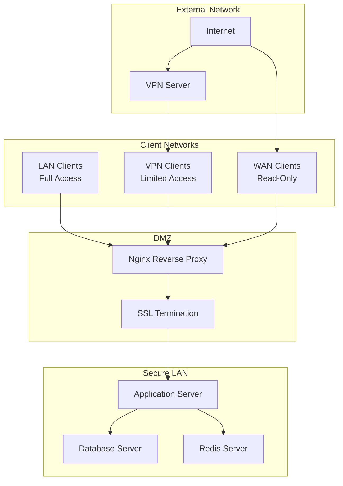

### Network Security Zones

#### Zone Configuration
```yaml
# Network security zones
zones:
  secure_lan:
    ip_ranges:
      - "192.168.1.0/24"
      - "10.0.0.0/24"
    access_level: "full"
    allowed_operations:
      - "create_personnel"
      - "create_inventory"
      - "create_transactions"
      - "admin_access"
  
  vpn_network:
    ip_ranges:
      - "10.8.0.0/24"
    access_level: "limited"
    allowed_operations:
      - "view_inventory"
      - "view_personnel"
      - "view_transactions"
  
  wan_access:
    ip_ranges:
      - "0.0.0.0/0"
    access_level: "readonly"
    allowed_operations:
      - "view_status"
      - "view_reports"
```

#### Port Configuration
```bash
# Firewall rules
# LAN access (full functionality)
iptables -A INPUT -s 192.168.1.0/24 -p tcp --dport 8443 -j ACCEPT

# WAN access (limited functionality)  
iptables -A INPUT -p tcp --dport 443 -j ACCEPT

# VPN access
iptables -A INPUT -s 10.8.0.0/24 -p tcp --dport 8443 -j ACCEPT

# Internal services (database, redis)
iptables -A INPUT -s 127.0.0.1 -p tcp --dport 5432 -j ACCEPT
iptables -A INPUT -s 127.0.0.1 -p tcp --dport 6379 -j ACCEPT
```

## Deployment Architecture

### Production Deployment Pattern

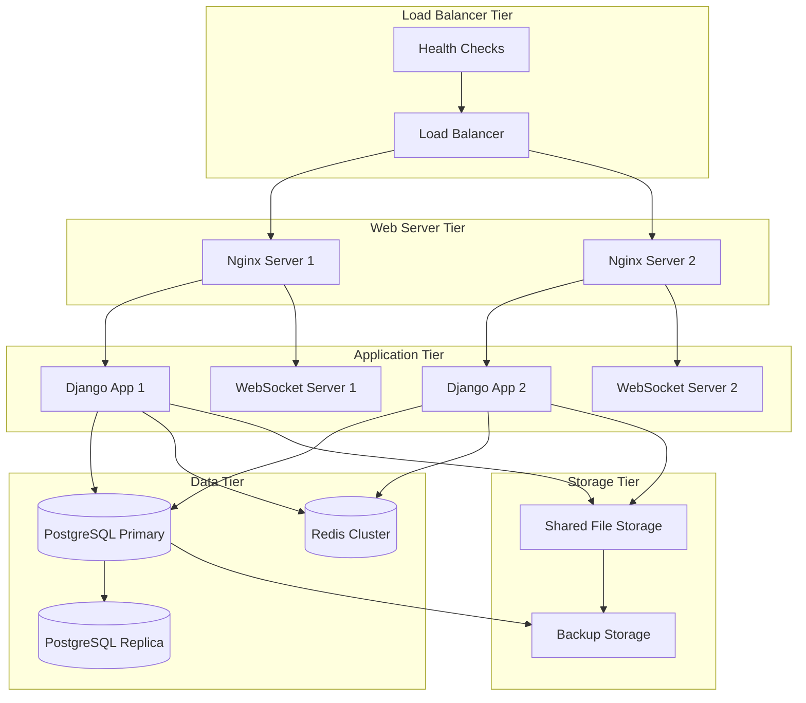

### Containerized Deployment (Docker)

```yaml
# docker-compose.yml
version: '3.8'

services:
  nginx:
    image: nginx:alpine
    ports:
      - "80:80"
      - "443:443"
    volumes:
      - ./nginx.conf:/etc/nginx/nginx.conf
      - ./ssl:/etc/nginx/ssl
      - static_files:/var/www/static

  django:
    build: .
    depends_on:
      - postgres
      - redis
    environment:
      - DJANGO_SETTINGS_MODULE=core.settings_production
    volumes:
      - media_files:/app/media
      - static_files:/app/static

  websocket:
    build: .
    command: daphne -b 0.0.0.0 -p 8001 core.asgi:application
    depends_on:
      - redis

  postgres:
    image: postgres:15-alpine
    environment:
      POSTGRES_DB: armguard
      POSTGRES_USER: armguard_user
      POSTGRES_PASSWORD: ${DB_PASSWORD}
    volumes:
      - postgres_data:/var/lib/postgresql/data

  redis:
    image: redis:7-alpine
    command: redis-server --appendonly yes
    volumes:
      - redis_data:/data

volumes:
  postgres_data:
  redis_data:
  media_files:
  static_files:
```

## Scalability Considerations

### Horizontal Scaling Architecture

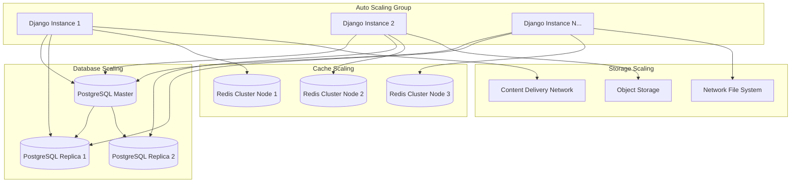

### Performance Optimization Strategies

#### Database Optimization
1. **Read Replicas**: Distribute read operations across multiple replicas
2. **Connection Pooling**: Reuse database connections efficiently
3. **Query Optimization**: Implement select_related and prefetch_related
4. **Index Strategy**: Strategic indexing for common query patterns
5. **Partitioning**: Date-based partitioning for large transaction tables

#### Caching Strategy
1. **Multi-Level Caching**: Template, query, and object caching
2. **Redis Clustering**: Distributed cache across multiple nodes
3. **Cache Invalidation**: Smart cache invalidation strategies
4. **Edge Caching**: CDN for static assets and media files

#### Application Optimization
1. **Code Profiling**: Regular performance monitoring and profiling
2. **Async Processing**: Background tasks for heavy operations
3. **Resource Pooling**: Connection and thread pool management
4. **Memory Management**: Efficient memory usage patterns

## Performance Architecture

### Performance Monitoring Stack

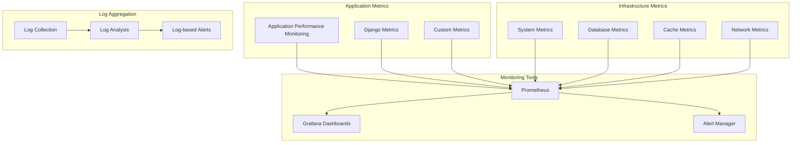

### Performance Benchmarks

#### Response Time Targets
- **Page Load Time**: < 2 seconds (LAN), < 5 seconds (WAN)
- **API Response Time**: < 500ms for GET requests, < 1s for POST requests
- **WebSocket Latency**: < 100ms for real-time updates
- **Database Query Time**: < 100ms for 95% of queries

#### Scalability Targets
- **Concurrent Users**: 100+ simultaneous users (LAN deployment)
- **Transaction Volume**: 1000+ transactions per day
- **Database Records**: 10,000+ personnel records, 50,000+ transactions
- **File Storage**: 10GB+ for QR codes, photos, and documents

#### Resource Utilization Targets
- **CPU Utilization**: < 70% average, < 90% peak
- **Memory Usage**: < 80% of available RAM
- **Database Connections**: < 50% of max connections
- **Cache Hit Ratio**: > 90% for frequently accessed data

---

**Document Version**: 1.0  
**Last Updated**: February 2026  
**Next Review**: March 2026  

---

*For installation procedures, see [installation.md](installation.md)*  
*For database schema details, see [database.md](database.md)*  
*For API documentation, see [api.md](api.md)*  
*For security implementation, see [security.md](security.md)*