# ARMGUARD - Database Design & Schema

## Table of Contents
- [Database Overview](#database-overview)
- [Database Schema](#database-schema)
- [Core Tables](#core-tables)
- [Relationship Model](#relationship-model)
- [Data Types and Constraints](#data-types-and-constraints)
- [Indexing Strategy](#indexing-strategy)
- [Migration Management](#migration-management)
- [Backup and Recovery](#backup-and-recovery)
- [Performance Optimization](#performance-optimization)
- [Data Integrity](#data-integrity)
- [Security Considerations](#security-considerations)

## Database Overview

### Database Architecture
ARMGUARD uses a **relational database design** optimized for military armory operations with emphasis on:
- **Data Integrity**: Strict constraints and foreign key relationships
- **Audit Trails**: Comprehensive logging of all data changes
- **Soft Deletes**: Historical data preservation for compliance
- **Performance**: Strategic indexing and query optimization
- **Security**: Encrypted storage and access control

### Database Engines
- **Production**: PostgreSQL 15+ (recommended)
- **Development**: SQLite 3.35+ (acceptable for development)
- **Testing**: In-memory SQLite (for unit tests)

### Key Design Principles
1. **ACID Compliance**: All transactions maintain atomicity, consistency, isolation, and durability
2. **Referential Integrity**: Strict foreign key constraints with CASCADE/PROTECT rules
3. **Data Normalization**: 3NF normalized structure to eliminate redundancy
4. **Audit Logging**: Every change tracked with user, timestamp, and IP address
5. **Soft Delete Pattern**: Logical deletion preserves historical records

## Database Schema

### Entity Relationship Diagram

```mermaid
erDiagram
    USER {
        int id PK
        string username UK "Unique login name"
        string email "Email address"
        string first_name "First name"
        string last_name "Last name"
        string password "Hashed password"
        boolean is_staff "Staff access flag"
        boolean is_superuser "Admin access flag"
        boolean is_active "Account active flag"
        datetime date_joined "Account creation date"
        datetime last_login "Last login timestamp"
    }
    
    USERPROFILE {
        int id PK
        int user_id FK "Reference to User"
        string role "User role (Admin/Armorer/Staff)"
        text authorized_devices "JSON list of authorized MAC addresses"
        datetime last_device_check "Last device authorization check"
        datetime created_at "Profile creation date"
        datetime updated_at "Profile update timestamp"
    }
    
    PERSONNEL {
        string id PK "PE-{serial}-{DDMMYY} format"
        string surname "Last name"
        string firstname "First name"
        string middle_initial "Middle initial (optional)"
        string rank "Military rank (SGT, CPL, PVT, etc.)"
        string serial UK "Military serial number"
        string group_field "Military group/unit"
        string classification "OFFICER or ENLISTED PERSONNEL"
        string status "Active/Inactive/Transferred"
        string telephone "Contact phone number"
        string picture "Photo file path"
        string qr_code "Generated QR code data"
        datetime created_at "Record creation timestamp"
        datetime updated_at "Last update timestamp"
        datetime deleted_at "Soft delete timestamp"
        int created_by FK "User who created record"
        int modified_by FK "User who last modified record"
    }
    
    ITEM {
        string id PK "I{R|P}{serial}-{DDMMYY} format"
        string item_type "M14/M16/M4/GLOCK/45"
        string serial UK "Weapon serial number"
        text description "Item description/notes"
        string condition "Good/Fair/Poor/Damaged"
        string status "Available/Issued/Maintenance/Retired"
        date registration_date "Item registration date"
        string qr_code "Generated QR code data"
        datetime created_at "Record creation timestamp"
        datetime updated_at "Last update timestamp"
    }
    
    TRANSACTION {
        int id PK "Auto-increment transaction ID"
        string personnel_id FK "Reference to Personnel"
        string item_id FK "Reference to Item"
        int issued_by FK "User who processed transaction"
        string action "Take or Return"
        datetime date_time "Transaction timestamp"
        int mags "Number of magazines (optional)"
        int rounds "Number of rounds (optional)"
        string duty_type "Duty/mission type (optional)"
        text notes "Additional notes (optional)"
        datetime created_at "Record creation timestamp"
        datetime updated_at "Last update timestamp"
    }
    
    QRCODEIMAGE {
        int id PK
        string qr_type "Personnel or Item"
        string reference_id "Personnel ID or Item ID"
        string qr_data "QR code data content"
        string qr_image_path "Path to QR image file"
        datetime created_at "QR code creation timestamp"
        datetime updated_at "QR code update timestamp"
    }
    
    AUDITLOG {
        int id PK
        string model_name "Model class name"
        string object_id "Primary key of changed object"
        string action "CREATE/UPDATE/DELETE"
        text changes "JSON of field changes"
        int user_id FK "User who made the change"
        string ip_address "IP address of user"
        string user_agent "Browser user agent"
        datetime timestamp "Change timestamp"
    }
    
    DELETEDRECORD {
        int id PK
        string original_model "Original model name"
        string original_id "Original primary key"
        text original_data "JSON snapshot of deleted data"
        int deleted_by FK "User who deleted record"
        datetime deleted_at "Deletion timestamp"
        string deletion_reason "Reason for deletion"
    }
    
    GROUP {
        int id PK
        string name UK "Group name (Admin/Armorer/Staff)"
    }
    
    PERMISSION {
        int id PK
        string name "Permission name"
        string codename UK "Permission code"
        int content_type_id FK "Content type reference"
    }
    
    USER_GROUPS {
        int user_id FK
        int group_id FK
    }
    
    GROUP_PERMISSIONS {
        int group_id FK
        int permission_id FK
    }
    
    SESSION {
        string session_key PK "Django session key"
        text session_data "Encrypted session data"
        datetime expire_date "Session expiration"
    }
    
    %% Relationships
    USER ||--o| USERPROFILE : "has profile"
    USER ||--o{ PERSONNEL : "created by"
    USER ||--o{ PERSONNEL : "modified by"
    USER ||--o{ TRANSACTION : "issued by"
    USER ||--o{ AUDITLOG : "performed by"
    USER ||--o{ DELETEDRECORD : "deleted by"
    USER }|--o{ USER_GROUPS : "member of"
    GROUP }|--o{ USER_GROUPS : "contains"
    GROUP }|--o{ GROUP_PERMISSIONS : "has"
    PERMISSION }|--o{ GROUP_PERMISSIONS : "granted to"
    
    PERSONNEL ||--o{ TRANSACTION : "participates in"
    ITEM ||--o{ TRANSACTION : "involved in"
    
    PERSONNEL ||--o| QRCODEIMAGE : "has QR code"
    ITEM ||--o| QRCODEIMAGE : "has QR code"
```



## Core Tables

### USER Table
**Purpose**: Django's built-in user authentication system
```sql
CREATE TABLE auth_user (
    id SERIAL PRIMARY KEY,
    username VARCHAR(150) NOT NULL UNIQUE,
    email VARCHAR(254) NOT NULL,
    first_name VARCHAR(150) NOT NULL,
    last_name VARCHAR(150) NOT NULL,
    password VARCHAR(128) NOT NULL,  -- Hashed with PBKDF2
    is_staff BOOLEAN NOT NULL DEFAULT FALSE,
    is_superuser BOOLEAN NOT NULL DEFAULT FALSE,
    is_active BOOLEAN NOT NULL DEFAULT TRUE,
    date_joined TIMESTAMP WITH TIME ZONE NOT NULL DEFAULT NOW(),
    last_login TIMESTAMP WITH TIME ZONE
);

-- Indexes
CREATE INDEX auth_user_username_idx ON auth_user(username);
CREATE INDEX auth_user_email_idx ON auth_user(email);
```

### USERPROFILE Table
**Purpose**: Extended user information and device authorization
```sql
CREATE TABLE users_userprofile (
    id SERIAL PRIMARY KEY,
    user_id INTEGER NOT NULL UNIQUE REFERENCES auth_user(id) ON DELETE CASCADE,
    role VARCHAR(20) NOT NULL DEFAULT 'Staff',
    authorized_devices TEXT,  -- JSON array of MAC addresses
    last_device_check TIMESTAMP WITH TIME ZONE,
    created_at TIMESTAMP WITH TIME ZONE NOT NULL DEFAULT NOW(),
    updated_at TIMESTAMP WITH TIME ZONE NOT NULL DEFAULT NOW(),
    
    CONSTRAINT valid_role CHECK (role IN ('Admin', 'Armorer', 'Staff'))
);

-- Indexes
CREATE INDEX users_userprofile_user_id_idx ON users_userprofile(user_id);
CREATE INDEX users_userprofile_role_idx ON users_userprofile(role);
```

### PERSONNEL Table
**Purpose**: Military personnel records with comprehensive information
```sql
CREATE TABLE personnel (
    id VARCHAR(50) PRIMARY KEY,  -- PE-{serial}-{DDMMYY}
    surname VARCHAR(100) NOT NULL,
    firstname VARCHAR(100) NOT NULL,
    middle_initial VARCHAR(1),
    rank VARCHAR(20) NOT NULL,
    serial VARCHAR(50) NOT NULL UNIQUE,
    group_field VARCHAR(50) NOT NULL,  -- 'group' is reserved keyword
    classification VARCHAR(50) NOT NULL DEFAULT 'ENLISTED PERSONNEL',
    status VARCHAR(20) NOT NULL DEFAULT 'Active',
    telephone VARCHAR(20),
    picture VARCHAR(255),  -- File path to photo
    qr_code VARCHAR(255),
    created_at TIMESTAMP WITH TIME ZONE NOT NULL DEFAULT NOW(),
    updated_at TIMESTAMP WITH TIME ZONE NOT NULL DEFAULT NOW(),
    deleted_at TIMESTAMP WITH TIME ZONE,  -- Soft delete
    created_by INTEGER REFERENCES auth_user(id) ON DELETE SET NULL,
    modified_by INTEGER REFERENCES auth_user(id) ON DELETE SET NULL,
    
    CONSTRAINT valid_rank CHECK (rank IN ('GEN', 'COL', 'LTC', 'MAJ', 'CPT', '1LT', '2LT', 
                                          'CSM', '1SG', 'MSG', 'SFC', 'SSG', 'SGT', 'CPL', 'PVT')),
    CONSTRAINT valid_classification CHECK (classification IN ('OFFICER', 'ENLISTED PERSONNEL')),
    CONSTRAINT valid_status CHECK (status IN ('Active', 'Inactive', 'Transferred', 'Separated'))
);

-- Indexes
CREATE INDEX personnel_serial_idx ON personnel(serial);
CREATE INDEX personnel_rank_idx ON personnel(rank);
CREATE INDEX personnel_status_group_idx ON personnel(status, group_field);
CREATE INDEX personnel_deleted_at_idx ON personnel(deleted_at) WHERE deleted_at IS NULL;
CREATE INDEX personnel_created_by_idx ON personnel(created_by);
CREATE INDEX personnel_modified_by_idx ON personnel(modified_by);

-- Soft delete view (active personnel only)
CREATE VIEW active_personnel AS 
SELECT * FROM personnel WHERE deleted_at IS NULL;
```

### ITEM Table
**Purpose**: Firearms and equipment inventory management
```sql
CREATE TABLE items (
    id VARCHAR(50) PRIMARY KEY,  -- I{R|P}{serial}-{DDMMYY}
    item_type VARCHAR(20) NOT NULL,
    serial VARCHAR(50) NOT NULL UNIQUE,
    description TEXT,
    condition VARCHAR(20) NOT NULL DEFAULT 'Good',
    status VARCHAR(20) NOT NULL DEFAULT 'Available',
    registration_date DATE NOT NULL DEFAULT CURRENT_DATE,
    qr_code VARCHAR(255),
    created_at TIMESTAMP WITH TIME ZONE NOT NULL DEFAULT NOW(),
    updated_at TIMESTAMP WITH TIME ZONE NOT NULL DEFAULT NOW(),
    
    CONSTRAINT valid_item_type CHECK (item_type IN ('M14', 'M16', 'M4', 'GLOCK', '45')),
    CONSTRAINT valid_condition CHECK (condition IN ('Good', 'Fair', 'Poor', 'Damaged')),
    CONSTRAINT valid_status CHECK (status IN ('Available', 'Issued', 'Maintenance', 'Retired'))
);

-- Indexes
CREATE INDEX items_item_type_idx ON items(item_type);
CREATE INDEX items_status_idx ON items(status);
CREATE INDEX items_condition_idx ON items(condition);
CREATE INDEX items_serial_idx ON items(serial);
CREATE INDEX items_type_status_idx ON items(item_type, status);
CREATE INDEX items_registration_date_idx ON items(registration_date);
```

### TRANSACTION Table
**Purpose**: Weapon withdrawal and return transaction records
```sql
CREATE TABLE transactions (
    id SERIAL PRIMARY KEY,
    personnel_id VARCHAR(50) NOT NULL REFERENCES personnel(id) ON DELETE PROTECT,
    item_id VARCHAR(50) NOT NULL REFERENCES items(id) ON DELETE PROTECT,
    issued_by INTEGER REFERENCES auth_user(id) ON DELETE SET NULL,
    action VARCHAR(20) NOT NULL,
    date_time TIMESTAMP WITH TIME ZONE NOT NULL DEFAULT NOW(),
    mags INTEGER DEFAULT 0,
    rounds INTEGER DEFAULT 0,
    duty_type VARCHAR(100),
    notes TEXT,
    created_at TIMESTAMP WITH TIME ZONE NOT NULL DEFAULT NOW(),
    updated_at TIMESTAMP WITH TIME ZONE NOT NULL DEFAULT NOW(),
    
    CONSTRAINT valid_action CHECK (action IN ('Take', 'Return')),
    CONSTRAINT non_negative_mags CHECK (mags >= 0),
    CONSTRAINT non_negative_rounds CHECK (rounds >= 0)
);

-- Indexes (optimized for common queries)
CREATE INDEX transactions_date_time_idx ON transactions(date_time DESC);
CREATE INDEX transactions_personnel_date_idx ON transactions(personnel_id, date_time DESC);
CREATE INDEX transactions_item_date_idx ON transactions(item_id, date_time DESC);
CREATE INDEX transactions_action_idx ON transactions(action);
CREATE INDEX transactions_issued_by_idx ON transactions(issued_by);

-- Composite indexes for complex queries
CREATE INDEX transactions_personnel_action_date_idx ON transactions(personnel_id, action, date_time DESC);
CREATE INDEX transactions_item_action_date_idx ON transactions(item_id, action, date_time DESC);
```

### QRCODEIMAGE Table
**Purpose**: QR code generation and management
```sql
CREATE TABLE qr_manager_qrcodeimage (
    id SERIAL PRIMARY KEY,
    qr_type VARCHAR(20) NOT NULL,
    reference_id VARCHAR(50) NOT NULL,
    qr_data VARCHAR(500) NOT NULL,
    qr_image_path VARCHAR(255),
    created_at TIMESTAMP WITH TIME ZONE NOT NULL DEFAULT NOW(),
    updated_at TIMESTAMP WITH TIME ZONE NOT NULL DEFAULT NOW(),
    
    CONSTRAINT valid_qr_type CHECK (qr_type IN ('Personnel', 'Item')),
    CONSTRAINT unique_qr_reference UNIQUE (qr_type, reference_id)
);

-- Indexes
CREATE INDEX qr_qr_type_idx ON qr_manager_qrcodeimage(qr_type);
CREATE INDEX qr_reference_id_idx ON qr_manager_qrcodeimage(reference_id);
CREATE UNIQUE INDEX qr_type_reference_idx ON qr_manager_qrcodeimage(qr_type, reference_id);
```

### AUDITLOG Table
**Purpose**: Comprehensive audit trail for all system changes
```sql
CREATE TABLE admin_auditlog (
    id SERIAL PRIMARY KEY,
    model_name VARCHAR(100) NOT NULL,
    object_id VARCHAR(50) NOT NULL,
    action VARCHAR(10) NOT NULL,
    changes TEXT,  -- JSON format
    user_id INTEGER REFERENCES auth_user(id) ON DELETE SET NULL,
    ip_address INET,
    user_agent TEXT,
    timestamp TIMESTAMP WITH TIME ZONE NOT NULL DEFAULT NOW(),
    
    CONSTRAINT valid_action CHECK (action IN ('CREATE', 'UPDATE', 'DELETE'))
);

-- Indexes for audit queries
CREATE INDEX audit_timestamp_idx ON admin_auditlog(timestamp DESC);
CREATE INDEX audit_model_object_idx ON admin_auditlog(model_name, object_id);
CREATE INDEX audit_user_timestamp_idx ON admin_auditlog(user_id, timestamp DESC);
CREATE INDEX audit_action_idx ON admin_auditlog(action);
CREATE INDEX audit_ip_address_idx ON admin_auditlog(ip_address);

-- Partitioning for large audit tables (monthly partitions)
-- CREATE TABLE admin_auditlog_y2026m02 PARTITION OF admin_auditlog
-- FOR VALUES FROM ('2026-02-01') TO ('2026-03-01');
```

### DELETEDRECORD Table
**Purpose**: Backup of soft-deleted records for recovery
```sql
CREATE TABLE admin_deletedrecord (
    id SERIAL PRIMARY KEY,
    original_model VARCHAR(100) NOT NULL,
    original_id VARCHAR(50) NOT NULL,
    original_data TEXT NOT NULL,  -- JSON snapshot
    deleted_by INTEGER REFERENCES auth_user(id) ON DELETE SET NULL,
    deleted_at TIMESTAMP WITH TIME ZONE NOT NULL DEFAULT NOW(),
    deletion_reason VARCHAR(255),
    
    CONSTRAINT unique_deleted_record UNIQUE (original_model, original_id)
);

-- Indexes
CREATE INDEX deleted_model_id_idx ON admin_deletedrecord(original_model, original_id);
CREATE INDEX deleted_by_idx ON admin_deletedrecord(deleted_by);
CREATE INDEX deleted_at_idx ON admin_deletedrecord(deleted_at DESC);
```

## Relationship Model

### Primary Relationships

#### User-Personnel Relationship
```sql
-- One user can create/modify multiple personnel records
ALTER TABLE personnel 
ADD CONSTRAINT fk_personnel_created_by 
FOREIGN KEY (created_by) REFERENCES auth_user(id) ON DELETE SET NULL;

ALTER TABLE personnel 
ADD CONSTRAINT fk_personnel_modified_by 
FOREIGN KEY (modified_by) REFERENCES auth_user(id) ON DELETE SET NULL;
```

#### Personnel-Transaction Relationship
```sql
-- One personnel can have multiple transactions
-- CASCADE delete prevented to maintain audit trail
ALTER TABLE transactions 
ADD CONSTRAINT fk_transaction_personnel 
FOREIGN KEY (personnel_id) REFERENCES personnel(id) ON DELETE PROTECT;
```

#### Item-Transaction Relationship
```sql
-- One item can have multiple transactions
-- CASCADE delete prevented to maintain audit trail
ALTER TABLE transactions 
ADD CONSTRAINT fk_transaction_item 
FOREIGN KEY (item_id) REFERENCES items(id) ON DELETE PROTECT;
```

#### QR Code Relationships
```sql
-- QR codes reference either personnel or items
-- Soft constraint through application logic (Django ForeignKey not used)
-- Unique constraint ensures one QR per personnel/item
ALTER TABLE qr_manager_qrcodeimage 
ADD CONSTRAINT unique_qr_per_entity 
UNIQUE (qr_type, reference_id);
```

### Referential Integrity Rules

#### ON DELETE Policies
- **CASCADE**: Remove dependent records (UserProfile → User)
- **PROTECT**: Prevent deletion if dependent records exist (Personnel/Item → Transaction)
- **SET NULL**: Set foreign key to NULL (Transaction → User who issued)

#### Business Logic Constraints
1. A personnel record cannot be hard deleted if they have transaction history
2. An item cannot be deleted if it has been issued and not returned
3. Transactions form a chain that must be validated for item status changes
4. QR codes must be regenerated if personnel/item data changes

## Data Types and Constraints

### Field Specifications

#### Personnel Table Fields
```sql
-- Primary fields with validation
surname VARCHAR(100) NOT NULL 
    CONSTRAINT surname_length CHECK (LENGTH(surname) >= 2),
    
firstname VARCHAR(100) NOT NULL 
    CONSTRAINT firstname_length CHECK (LENGTH(firstname) >= 2),
    
rank VARCHAR(20) NOT NULL 
    CONSTRAINT valid_military_rank CHECK (rank IN (...)),
    
serial VARCHAR(50) NOT NULL UNIQUE 
    CONSTRAINT serial_format CHECK (serial ~ '^[0-9]{8,12}$'),
    
telephone VARCHAR(20) 
    CONSTRAINT valid_phone CHECK (telephone ~ '^\+?[0-9-\s()]+$'),
    
-- Audit fields
created_at TIMESTAMP WITH TIME ZONE NOT NULL DEFAULT NOW(),
updated_at TIMESTAMP WITH TIME ZONE NOT NULL DEFAULT NOW(),
deleted_at TIMESTAMP WITH TIME ZONE 
    CONSTRAINT future_delete_invalid CHECK (deleted_at <= NOW())
```

#### Item Table Fields
```sql
-- Item identification
item_type VARCHAR(20) NOT NULL 
    CONSTRAINT valid_weapon_type CHECK (item_type IN ('M14', 'M16', 'M4', 'GLOCK', '45')),
    
serial VARCHAR(50) NOT NULL UNIQUE 
    CONSTRAINT serial_not_empty CHECK (LENGTH(TRIM(serial)) > 0),
    
-- Status fields with business validation
status VARCHAR(20) NOT NULL DEFAULT 'Available'
    CONSTRAINT valid_item_status CHECK (status IN ('Available', 'Issued', 'Maintenance', 'Retired')),
    
condition VARCHAR(20) NOT NULL DEFAULT 'Good'
    CONSTRAINT valid_item_condition CHECK (condition IN ('Good', 'Fair', 'Poor', 'Damaged')),
    
-- Date validation
registration_date DATE NOT NULL DEFAULT CURRENT_DATE
    CONSTRAINT registration_not_future CHECK (registration_date <= CURRENT_DATE)
```

#### Transaction Table Fields
```sql
-- Transaction validation
action VARCHAR(20) NOT NULL 
    CONSTRAINT valid_transaction_action CHECK (action IN ('Take', 'Return')),
    
date_time TIMESTAMP WITH TIME ZONE NOT NULL DEFAULT NOW()
    CONSTRAINT transaction_not_future CHECK (date_time <= NOW()),
    
-- Optional ammunition tracking
mags INTEGER DEFAULT 0 
    CONSTRAINT mags_non_negative CHECK (mags >= 0)
    CONSTRAINT mags_reasonable CHECK (mags <= 50),
    
rounds INTEGER DEFAULT 0 
    CONSTRAINT rounds_non_negative CHECK (rounds >= 0)
    CONSTRAINT rounds_reasonable CHECK (rounds <= 10000)
```

### Custom Validation Functions

#### Personnel ID Generation
```sql
CREATE OR REPLACE FUNCTION generate_personnel_id(p_serial VARCHAR, p_date DATE DEFAULT CURRENT_DATE)
RETURNS VARCHAR AS $$
BEGIN
    RETURN 'PE-' || p_serial || '-' || TO_CHAR(p_date, 'DDMMYY');
END;
$$ LANGUAGE plpgsql IMMUTABLE;
```

#### Item ID Generation
```sql
CREATE OR REPLACE FUNCTION generate_item_id(p_item_type VARCHAR, p_serial VARCHAR, p_date DATE DEFAULT CURRENT_DATE)
RETURNS VARCHAR AS $$
DECLARE
    category CHAR(1);
BEGIN
    -- Determine if rifle (R) or pistol (P)
    IF p_item_type IN ('M14', 'M16', 'M4') THEN
        category := 'R';
    ELSE
        category := 'P';
    END IF;
    
    RETURN 'I' || category || p_serial || '-' || TO_CHAR(p_date, 'DDMMYY');
END;
$$ LANGUAGE plpgsql IMMUTABLE;
```

#### Transaction Status Validation
```sql
CREATE OR REPLACE FUNCTION validate_transaction_status()
RETURNS TRIGGER AS $$
DECLARE
    current_item_status VARCHAR;
    last_transaction_action VARCHAR;
BEGIN
    -- Get current item status
    SELECT status INTO current_item_status 
    FROM items WHERE id = NEW.item_id;
    
    -- Get last transaction for this item
    SELECT action INTO last_transaction_action
    FROM transactions 
    WHERE item_id = NEW.item_id 
    ORDER BY date_time DESC 
    LIMIT 1;
    
    -- Validate transaction logic
    IF NEW.action = 'Take' THEN
        IF current_item_status != 'Available' THEN
            RAISE EXCEPTION 'Item % is not available for withdrawal', NEW.item_id;
        END IF;
    ELSIF NEW.action = 'Return' THEN
        IF current_item_status != 'Issued' THEN
            RAISE EXCEPTION 'Item % is not currently issued', NEW.item_id;
        END IF;
        IF last_transaction_action != 'Take' THEN
            RAISE EXCEPTION 'Cannot return item % that was not withdrawn', NEW.item_id;
        END IF;
    END IF;
    
    RETURN NEW;
END;
$$ LANGUAGE plpgsql;

-- Create trigger
CREATE TRIGGER transaction_status_validation
    BEFORE INSERT ON transactions
    FOR EACH ROW
    EXECUTE FUNCTION validate_transaction_status();
```

## Indexing Strategy

### Performance Indexes

#### High-Frequency Query Indexes
```sql
-- Personnel searches by rank and status
CREATE INDEX idx_personnel_active_by_rank ON personnel(rank, status) 
WHERE deleted_at IS NULL;

-- Item availability queries
CREATE INDEX idx_items_available_by_type ON items(item_type, status)
WHERE status = 'Available';

-- Recent transactions (dashboard queries)
CREATE INDEX idx_transactions_recent ON transactions(date_time DESC)
WHERE date_time > (NOW() - INTERVAL '30 days');

-- Audit log searches
CREATE INDEX idx_audit_recent_changes ON admin_auditlog(timestamp DESC, model_name)
WHERE timestamp > (NOW() - INTERVAL '7 days');
```

#### Composite Indexes for Complex Queries
```sql
-- Personnel transaction history
CREATE INDEX idx_personnel_transaction_history 
ON transactions(personnel_id, date_time DESC, action);

-- Item transaction history
CREATE INDEX idx_item_transaction_history 
ON transactions(item_id, date_time DESC, action);

-- Active personnel by group and rank
CREATE INDEX idx_active_personnel_group_rank 
ON personnel(group_field, rank, status) 
WHERE deleted_at IS NULL;

-- Available items by type and condition
CREATE INDEX idx_available_items_type_condition 
ON items(item_type, condition, status) 
WHERE status = 'Available';
```

#### Partial Indexes for Optimization
```sql
-- Only index active records
CREATE INDEX idx_personnel_active_only 
ON personnel(surname, firstname) 
WHERE deleted_at IS NULL;

-- Only index current transactions (not old ones)
CREATE INDEX idx_transactions_current 
ON transactions(personnel_id, item_id, action) 
WHERE date_time > (NOW() - INTERVAL '1 year');

-- QR codes for active entities only
CREATE INDEX idx_qr_active_personnel 
ON qr_manager_qrcodeimage(reference_id) 
WHERE qr_type = 'Personnel';
```

### Index Maintenance

#### Index Usage Monitoring
```sql
-- Check index usage statistics
SELECT 
    schemaname,
    tablename,
    indexname,
    idx_scan,
    idx_tup_read,
    idx_tup_fetch
FROM pg_stat_user_indexes
ORDER BY idx_scan DESC;

-- Find unused indexes
SELECT 
    schemaname,
    tablename,
    indexname
FROM pg_stat_user_indexes
WHERE idx_scan = 0
AND indexname NOT LIKE '%_pkey';
```

#### Index Optimization Script
```sql
-- Analyze table statistics for query planner
ANALYZE personnel;
ANALYZE items;
ANALYZE transactions;
ANALYZE admin_auditlog;

-- Reindex heavily updated tables (monthly maintenance)
REINDEX TABLE transactions;
REINDEX TABLE admin_auditlog;

-- Update table statistics after bulk operations
VACUUM ANALYZE personnel;
VACUUM ANALYZE items;
```

## Migration Management

### Django Migration System

#### Migration Structure
```python
# migrations/0001_initial.py
from django.db import migrations, models
import django.db.models.deletion

class Migration(migrations.Migration):
    initial = True
    
    dependencies = [
        ('auth', '0012_alter_user_first_name_max_length'),
    ]
    
    operations = [
        migrations.CreateModel(
            name='Personnel',
            fields=[
                ('id', models.CharField(max_length=50, primary_key=True)),
                ('surname', models.CharField(max_length=100)),
                # ... other fields
                ('created_by', models.ForeignKey(
                    null=True, blank=True,
                    on_delete=models.SET_NULL,
                    to='auth.User')),
            ],
            options={
                'db_table': 'personnel',
                'ordering': ['rank', 'surname'],
            },
        ),
        # Additional model creations...
    ]
```

#### Data Migration Example
```python
# migrations/0002_populate_qr_codes.py
from django.db import migrations

def generate_qr_codes(apps, schema_editor):
    Personnel = apps.get_model('personnel', 'Personnel')
    QRCodeImage = apps.get_model('qr_manager', 'QRCodeImage')
    
    for personnel in Personnel.objects.all():
        QRCodeImage.objects.get_or_create(
            qr_type='Personnel',
            reference_id=personnel.id,
            defaults={
                'qr_data': f"PERSONNEL:{personnel.id}",
                'qr_image_path': f"qr_codes/personnel/{personnel.id}.png"
            }
        )

def reverse_qr_codes(apps, schema_editor):
    QRCodeImage = apps.get_model('qr_manager', 'QRCodeImage')
    QRCodeImage.objects.filter(qr_type='Personnel').delete()

class Migration(migrations.Migration):
    dependencies = [
        ('personnel', '0001_initial'),
        ('qr_manager', '0001_initial'),
    ]
    
    operations = [
        migrations.RunPython(generate_qr_codes, reverse_qr_codes),
    ]
```

#### Schema Change Migration
```python
# migrations/0003_add_classification_field.py
from django.db import migrations, models

class Migration(migrations.Migration):
    dependencies = [
        ('personnel', '0002_populate_qr_codes'),
    ]
    
    operations = [
        migrations.AddField(
            model_name='personnel',
            name='classification',
            field=models.CharField(
                max_length=50,
                choices=[
                    ('OFFICER', 'Officer'),
                    ('ENLISTED PERSONNEL', 'Enlisted Personnel')
                ],
                default='ENLISTED PERSONNEL'
            ),
        ),
        # Create index for new field
        migrations.RunSQL(
            "CREATE INDEX idx_personnel_classification ON personnel(classification);",
            reverse_sql="DROP INDEX IF EXISTS idx_personnel_classification;"
        ),
    ]
```

### Migration Best Practices

#### Safe Migration Strategies
1. **Additive Changes**: Always add new fields as nullable or with defaults
2. **Backward Compatibility**: Ensure old code can still function during deployment
3. **Data Validation**: Validate data before and after migrations
4. **Rollback Plans**: Always have a rollback strategy for complex migrations
5. **Testing**: Test migrations on production-like data

#### Migration Checklist
```bash
# Pre-migration checks
python manage.py check --deploy
python manage.py makemigrations --check --dry-run

# Migration execution
python manage.py migrate --plan  # Show migration plan
python manage.py migrate --fake-initial  # If needed for existing DB
python manage.py migrate

# Post-migration verification
python manage.py check
python manage.py showmigrations
python manage.py shell  # Test data integrity
```

## Backup and Recovery

### Backup Strategy

#### Database Backup Types
1. **Full Backup**: Complete database dump (daily)
2. **Incremental Backup**: Changes since last backup (hourly)
3. **Transaction Log Backup**: Point-in-time recovery (continuous)
4. **Schema Backup**: Structure only (before migrations)

#### PostgreSQL Backup Scripts
```bash
#!/bin/bash
# Full database backup script
DB_NAME="armguard"
DB_USER="armguard_backup"
BACKUP_DIR="/var/backups/armguard"
DATE=$(date +%Y%m%d_%H%M%S)

# Create backup directory
mkdir -p $BACKUP_DIR

# Full database backup with compression
pg_dump -h localhost -U $DB_USER -d $DB_NAME \
    --verbose --no-password --format=custom \
    --file=$BACKUP_DIR/armguard_full_$DATE.backup

# Schema-only backup
pg_dump -h localhost -U $DB_USER -d $DB_NAME \
    --schema-only --verbose --no-password \
    --file=$BACKUP_DIR/armguard_schema_$DATE.sql

# Compress backups
gzip $BACKUP_DIR/armguard_schema_$DATE.sql

# Remove backups older than 30 days
find $BACKUP_DIR -name "armguard_*.backup" -mtime +30 -delete
find $BACKUP_DIR -name "armguard_*.sql.gz" -mtime +30 -delete

echo "Backup completed: armguard_full_$DATE.backup"
```

#### Point-in-Time Recovery Setup
```bash
# Enable WAL archiving in postgresql.conf
wal_level = replica
archive_mode = on
archive_command = 'cp %p /var/lib/postgresql/wal_archive/%f'
max_wal_senders = 3
checkpoint_completion_target = 0.9
```

#### Recovery Procedures
```bash
# Full database restoration
sudo -u postgres dropdb armguard
sudo -u postgres createdb armguard
sudo -u postgres pg_restore -d armguard /var/backups/armguard/armguard_full_20260209.backup

# Point-in-time recovery
sudo -u postgres pg_basebackup -D /var/lib/postgresql/recovery -Ft -z
# Configure recovery.conf with target time
sudo -u postgres pg_ctl start -D /var/lib/postgresql/recovery
```

### Disaster Recovery Plan

#### Recovery Time Objectives (RTO)
- **Database Restoration**: < 1 hour
- **Application Restart**: < 15 minutes
- **Full System Recovery**: < 4 hours

#### Recovery Point Objectives (RPO)
- **Data Loss Tolerance**: < 15 minutes
- **Transaction Recovery**: All committed transactions
- **Backup Frequency**: Every 15 minutes (transaction logs)

#### Emergency Procedures
1. **System Failure**: Restart services, restore from last backup
2. **Data Corruption**: Point-in-time recovery to last known good state
3. **Security Breach**: Isolation, forensics, clean restore
4. **Hardware Failure**: Migration to standby hardware with data restore

## Performance Optimization

### Query Performance

#### Slow Query Identification
```sql
-- Enable slow query logging
ALTER SYSTEM SET log_min_duration_statement = 1000; -- Log queries > 1 second
SELECT pg_reload_conf();

-- Find slowest queries
SELECT 
    query,
    calls,
    total_time,
    mean_time,
    max_time
FROM pg_stat_statements
WHERE calls > 100
ORDER BY mean_time DESC
LIMIT 10;
```

#### Query Optimization Examples
```sql
-- Before: Slow personnel search
SELECT p.*, u.username 
FROM personnel p, auth_user u 
WHERE p.created_by = u.id 
AND p.status = 'Active' 
AND p.deleted_at IS NULL;

-- After: Optimized with proper JOIN and index usage
SELECT p.*, u.username 
FROM personnel p 
INNER JOIN auth_user u ON p.created_by = u.id 
WHERE p.status = 'Active' 
AND p.deleted_at IS NULL;

-- Index to support this query
CREATE INDEX idx_personnel_active_status 
ON personnel(status, deleted_at, created_by) 
WHERE deleted_at IS NULL;
```

#### Connection Pooling Configuration
```python
# Django settings for connection pooling
DATABASES = {
    'default': {
        'ENGINE': 'django.db.backends.postgresql',
        'NAME': 'armguard',
        'USER': 'armguard_user',
        'PASSWORD': 'secure_password',
        'HOST': 'localhost',
        'PORT': '5432',
        'CONN_MAX_AGE': 600,  # Connection pooling
        'OPTIONS': {
            'MAX_CONNS': 20,  # Maximum connections
            'connect_timeout': 10,
            'options': '-c search_path=public'
        },
    }
}
```

### Database Maintenance

#### Regular Maintenance Tasks
```sql
-- Weekly maintenance script
-- Analyze table statistics
ANALYZE personnel;
ANALYZE items;
ANALYZE transactions;
ANALYZE admin_auditlog;

-- Vacuum to reclaim space
VACUUM ANALYZE personnel;
VACUUM ANALYZE admin_auditlog;

-- Reindex frequently updated tables
REINDEX INDEX transactions_date_time_idx;
REINDEX INDEX audit_timestamp_idx;

-- Update table statistics
SELECT 
    schemaname,
    tablename,
    n_tup_ins,
    n_tup_upd,
    n_tup_del,
    last_vacuum,
    last_analyze
FROM pg_stat_user_tables
ORDER BY last_analyze;
```

#### Performance Monitoring
```sql
-- Check database performance metrics
SELECT 
    datname,
    numbackends,
    xact_commit,
    xact_rollback,
    blks_read,
    blks_hit,
    temp_files,
    temp_bytes
FROM pg_stat_database
WHERE datname = 'armguard';

-- Monitor lock contention
SELECT 
    blocked_locks.pid AS blocked_pid,
    blocked_activity.usename AS blocked_user,
    blocking_locks.pid AS blocking_pid,
    blocking_activity.usename AS blocking_user,
    blocked_activity.query AS blocked_statement
FROM pg_catalog.pg_locks blocked_locks
JOIN pg_catalog.pg_stat_activity blocked_activity 
    ON blocked_activity.pid = blocked_locks.pid
JOIN pg_catalog.pg_locks blocking_locks 
    ON blocking_locks.locktype = blocked_locks.locktype
WHERE NOT blocked_locks.granted;
```

## Data Integrity

### Referential Integrity

#### Constraint Definitions
```sql
-- Ensure transaction integrity
ALTER TABLE transactions 
ADD CONSTRAINT fk_transaction_personnel_valid
FOREIGN KEY (personnel_id) REFERENCES personnel(id) 
ON DELETE PROTECT;  -- Cannot delete personnel with transaction history

-- Ensure item tracking integrity
ALTER TABLE transactions 
ADD CONSTRAINT fk_transaction_item_valid
FOREIGN KEY (item_id) REFERENCES items(id) 
ON DELETE PROTECT;  -- Cannot delete items with transaction history

-- Ensure user accountability
ALTER TABLE transactions 
ADD CONSTRAINT fk_transaction_issuer_valid
FOREIGN KEY (issued_by) REFERENCES auth_user(id) 
ON DELETE SET NULL;  -- Keep transaction record even if user is deleted
```

#### Business Rule Enforcement
```sql
-- Personnel cannot have duplicate active records
CREATE UNIQUE INDEX idx_personnel_unique_active_serial 
ON personnel(serial) 
WHERE deleted_at IS NULL;

-- Items cannot have duplicate serial numbers
CREATE UNIQUE INDEX idx_items_unique_serial 
ON items(serial);

-- Transaction business rules trigger
CREATE OR REPLACE FUNCTION enforce_transaction_business_rules()
RETURNS TRIGGER AS $$
DECLARE
    item_status VARCHAR;
    personnel_active BOOLEAN;
    outstanding_items INTEGER;
BEGIN
    -- Check if personnel is active
    SELECT (deleted_at IS NULL AND status = 'Active') INTO personnel_active
    FROM personnel WHERE id = NEW.personnel_id;
    
    IF NOT personnel_active THEN
        RAISE EXCEPTION 'Cannot create transaction for inactive personnel: %', NEW.personnel_id;
    END IF;
    
    -- Check item status
    SELECT status INTO item_status FROM items WHERE id = NEW.item_id;
    
    IF NEW.action = 'Take' THEN
        -- Item must be available for withdrawal
        IF item_status != 'Available' THEN
            RAISE EXCEPTION 'Item % is not available (current status: %)', NEW.item_id, item_status;
        END IF;
        
        -- Check if personnel already has maximum allowed items (business rule: max 1 weapon)
        SELECT COUNT(*) INTO outstanding_items
        FROM transactions t1
        WHERE t1.personnel_id = NEW.personnel_id
        AND t1.action = 'Take'
        AND NOT EXISTS (
            SELECT 1 FROM transactions t2 
            WHERE t2.personnel_id = t1.personnel_id 
            AND t2.item_id = t1.item_id 
            AND t2.action = 'Return' 
            AND t2.date_time > t1.date_time
        );
        
        IF outstanding_items >= 1 THEN
            RAISE EXCEPTION 'Personnel % already has an outstanding weapon', NEW.personnel_id;
        END IF;
        
        -- Update item status to issued
        UPDATE items SET status = 'Issued' WHERE id = NEW.item_id;
        
    ELSIF NEW.action = 'Return' THEN
        -- Item must be issued for return
        IF item_status != 'Issued' THEN
            RAISE EXCEPTION 'Item % is not issued (current status: %)', NEW.item_id, item_status;
        END IF;
        
        -- Update item status to available
        UPDATE items SET status = 'Available' WHERE id = NEW.item_id;
    END IF;
    
    RETURN NEW;
END;
$$ LANGUAGE plpgsql;

-- Attach trigger
CREATE TRIGGER enforce_transaction_business_rules_trigger
    BEFORE INSERT ON transactions
    FOR EACH ROW
    EXECUTE FUNCTION enforce_transaction_business_rules();
```

### Data Validation

#### Input Validation Functions
```sql
-- Validate military serial number format
CREATE OR REPLACE FUNCTION validate_military_serial(serial_num VARCHAR)
RETURNS BOOLEAN AS $$
BEGIN
    -- Military serial: 8-12 digits
    RETURN serial_num ~ '^[0-9]{8,12}$';
END;
$$ LANGUAGE plpgsql IMMUTABLE;

-- Validate phone number format
CREATE OR REPLACE FUNCTION validate_phone_number(phone VARCHAR)
RETURNS BOOLEAN AS $$
BEGIN
    -- International or local format
    RETURN phone ~ '^[\+]?[0-9\-\s\(\)]{10,20}$';
END;
$$ LANGUAGE plpgsql IMMUTABLE;

-- Validate weapon serial number
CREATE OR REPLACE FUNCTION validate_weapon_serial(weapon_type VARCHAR, serial_num VARCHAR)
RETURNS BOOLEAN AS $$
BEGIN
    CASE weapon_type
        WHEN 'M16', 'M14', 'M4' THEN
            -- Military rifle serials: letters and numbers
            RETURN serial_num ~ '^[A-Z0-9]{6,15}$';
        WHEN 'GLOCK' THEN
            -- Glock serials: specific format
            RETURN serial_num ~ '^[A-Z]{3}[0-9]{3}$';
        WHEN '45' THEN
            -- .45 pistol serials: numbers
            RETURN serial_num ~ '^[0-9]{6,10}$';
        ELSE
            RETURN FALSE;
    END CASE;
END;
$$ LANGUAGE plpgsql IMMUTABLE;
```

#### Data Quality Checks
```sql
-- Data quality monitoring view
CREATE VIEW data_quality_report AS
SELECT 
    'personnel' AS table_name,
    'missing_phone' AS issue,
    COUNT(*) AS count
FROM personnel 
WHERE telephone IS NULL OR telephone = ''
AND deleted_at IS NULL

UNION ALL

SELECT 
    'personnel' AS table_name,
    'invalid_serial' AS issue,
    COUNT(*) AS count
FROM personnel 
WHERE NOT validate_military_serial(serial)
AND deleted_at IS NULL

UNION ALL

SELECT 
    'items' AS table_name,
    'missing_description' AS issue,
    COUNT(*) AS count
FROM items 
WHERE description IS NULL OR description = ''

UNION ALL

SELECT 
    'transactions' AS table_name,
    'future_transactions' AS issue,
    COUNT(*) AS count
FROM transactions 
WHERE date_time > NOW();
```

## Security Considerations

### Database Security

#### User Access Control
```sql
-- Create database roles with minimal privileges
CREATE ROLE armguard_app WITH LOGIN PASSWORD 'app_password';
CREATE ROLE armguard_readonly WITH LOGIN PASSWORD 'readonly_password';
CREATE ROLE armguard_backup WITH LOGIN PASSWORD 'backup_password';

-- Grant appropriate permissions
-- Application role: full access to application tables
GRANT SELECT, INSERT, UPDATE, DELETE ON personnel TO armguard_app;
GRANT SELECT, INSERT, UPDATE, DELETE ON items TO armguard_app;
GRANT SELECT, INSERT, UPDATE, DELETE ON transactions TO armguard_app;
GRANT SELECT, INSERT, UPDATE, DELETE ON admin_auditlog TO armguard_app;
GRANT USAGE, SELECT ON ALL SEQUENCES IN SCHEMA public TO armguard_app;

-- Read-only role: for reporting and monitoring
GRANT SELECT ON ALL TABLES IN SCHEMA public TO armguard_readonly;

-- Backup role: for database backups
GRANT SELECT ON ALL TABLES IN SCHEMA public TO armguard_backup;
ALTER ROLE armguard_backup WITH REPLICATION;
```

#### Row-Level Security (RLS)
```sql
-- Enable row-level security for sensitive tables
ALTER TABLE personnel ENABLE ROW LEVEL SECURITY;
ALTER TABLE admin_auditlog ENABLE ROW LEVEL SECURITY;

-- Policy: Users can only see records they created or modified
CREATE POLICY personnel_access_policy ON personnel
FOR ALL
TO armguard_app
USING (
    created_by = current_setting('app.current_user_id')::integer OR
    modified_by = current_setting('app.current_user_id')::integer OR
    current_setting('app.user_role') = 'Admin'
);

-- Policy: Audit logs are append-only
CREATE POLICY audit_append_only ON admin_auditlog
FOR INSERT
TO armguard_app
WITH CHECK (user_id = current_setting('app.current_user_id')::integer);

-- Policy: Read audit logs only for authorized users
CREATE POLICY audit_read_access ON admin_auditlog
FOR SELECT
TO armguard_app
USING (
    current_setting('app.user_role') IN ('Admin', 'Armorer')
);
```

#### Data Encryption
```sql
-- Enable transparent data encryption (TDE) - PostgreSQL 15+
-- Encrypt sensitive columns
CREATE EXTENSION IF NOT EXISTS pgcrypto;

-- Encrypt personnel phone numbers
ALTER TABLE personnel 
ADD COLUMN telephone_encrypted BYTEA;

UPDATE personnel 
SET telephone_encrypted = pgp_sym_encrypt(telephone, 'encryption_key')
WHERE telephone IS NOT NULL;

-- Function to decrypt phone numbers
CREATE OR REPLACE FUNCTION decrypt_telephone(encrypted_phone BYTEA)
RETURNS VARCHAR AS $$
BEGIN
    RETURN pgp_sym_decrypt(encrypted_phone, 'encryption_key');
EXCEPTION
    WHEN OTHERS THEN
        RETURN '[ENCRYPTED]';
END;
$$ LANGUAGE plpgsql SECURITY DEFINER;
```

### Audit Trail Security

#### Tamper-Proof Audit Logging
```sql
-- Create audit trail with hash verification
ALTER TABLE admin_auditlog ADD COLUMN record_hash VARCHAR(64);

-- Function to generate audit record hash
CREATE OR REPLACE FUNCTION generate_audit_hash(
    p_model VARCHAR, 
    p_object_id VARCHAR, 
    p_action VARCHAR, 
    p_changes TEXT,
    p_timestamp TIMESTAMP
) RETURNS VARCHAR AS $$
BEGIN
    RETURN encode(
        sha256(
            (p_model || p_object_id || p_action || COALESCE(p_changes, '') || p_timestamp::text)::bytea
        ), 
        'hex'
    );
END;
$$ LANGUAGE plpgsql IMMUTABLE;

-- Trigger to automatically generate hash
CREATE OR REPLACE FUNCTION audit_hash_trigger()
RETURNS TRIGGER AS $$
BEGIN
    NEW.record_hash := generate_audit_hash(
        NEW.model_name,
        NEW.object_id,
        NEW.action,
        NEW.changes,
        NEW.timestamp
    );
    RETURN NEW;
END;
$$ LANGUAGE plpgsql;

CREATE TRIGGER audit_hash_generation
    BEFORE INSERT ON admin_auditlog
    FOR EACH ROW
    EXECUTE FUNCTION audit_hash_trigger();
```

#### Audit Log Integrity Verification
```sql
-- Function to verify audit log integrity
CREATE OR REPLACE FUNCTION verify_audit_integrity()
RETURNS TABLE(
    log_id INTEGER,
    is_valid BOOLEAN,
    expected_hash VARCHAR,
    actual_hash VARCHAR
) AS $$
BEGIN
    RETURN QUERY
    SELECT 
        a.id,
        a.record_hash = generate_audit_hash(
            a.model_name, a.object_id, a.action, a.changes, a.timestamp
        ) AS is_valid,
        generate_audit_hash(
            a.model_name, a.object_id, a.action, a.changes, a.timestamp
        ) AS expected_hash,
        a.record_hash AS actual_hash
    FROM admin_auditlog a
    WHERE a.record_hash IS NOT NULL;
END;
$$ LANGUAGE plpgsql;

-- Check for tampered audit records
SELECT * FROM verify_audit_integrity() WHERE NOT is_valid;
```

---

**Document Version**: 1.0  
**Last Updated**: February 2026  
**Next Review**: March 2026  

---

*For system architecture details, see [architecture.md](architecture.md)*  
*For API documentation, see [api.md](api.md)*  
*For installation procedures, see [installation.md](installation.md)*  
*For security implementation, see [security.md](security.md)*