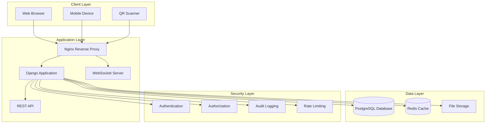

# ARMGUARD - Project Overview

## Table of Contents
- [Project Purpose](#project-purpose)
- [Target Audience](#target-audience)
- [Use Cases](#use-cases)
- [High-Level Architecture](#high-level-architecture)
- [Technology Stack](#technology-stack)
- [Key Features](#key-features)
- [System Requirements](#system-requirements)

## Project Purpose

**ARMGUARD** is a comprehensive military armory management system designed to provide secure, efficient, and auditable tracking of firearms and personnel within military installations. The system ensures full accountability of weapons inventory, personnel assignments, and transaction records while maintaining the highest security standards required for military operations.

### Mission Statement
To provide military organizations with a reliable, secure, and user-friendly platform for managing armory operations, ensuring complete accountability of weapons inventory and personnel interactions while maintaining compliance with military regulations and audit requirements.

## Target Audience

### Primary Users
- **Military Armorers**: Responsible for daily weapons maintenance, issuance, and inventory management
- **Commanding Officers**: Requiring oversight of armory operations and personnel weapon assignments
- **Administrative Staff**: Managing personnel records and system administration
- **Security Personnel**: Monitoring and auditing armory activities

### Secondary Users
- **IT Administrators**: Managing system deployment, maintenance, and security
- **Audit Personnel**: Conducting periodic reviews and compliance checks
- **Emergency Responders**: Accessing critical information during emergency situations

## Use Cases

### Core Operations
1. **Personnel Management**
   - Register and manage military personnel profiles
   - Track personnel status, ranks, and assignments
   - Generate QR codes for personnel identification
   - Maintain comprehensive personnel records

2. **Inventory Management**
   - Track firearms inventory (M14, M16, M4, Glock, .45 caliber weapons)
   - Monitor weapon status (Available, Issued, Maintenance, Retired)
   - Manage weapon condition assessments
   - Generate QR codes for weapon identification

3. **Transaction Processing**
   - Process weapon withdrawals and returns
   - Track ammunition distribution (magazines, rounds)
   - Record duty assignments and purposes
   - Maintain transaction audit trails

4. **Real-time Monitoring**
   - Live dashboard updates via WebSocket connections
   - Instant notifications for critical events
   - Real-time status tracking
   - Live inventory updates

### Security Operations
1. **Access Control**
   - Multi-level user authentication
   - Role-based permissions (Admin, Armorer, Staff)
   - Network-based access restrictions (LAN/WAN)
   - Device authorization controls

2. **Audit and Compliance**
   - Comprehensive audit logging
   - Transaction history tracking
   - Security event monitoring
   - Regulatory compliance reporting

## High-Level Architecture

### Architecture Components

#### Frontend Layer
- **Web Interface**: Modern responsive web application
- **Mobile Support**: Cross-platform mobile compatibility
- **QR Code Integration**: Camera-based QR scanning functionality

#### Application Layer
- **Django Framework**: Python-based web application framework
- **WebSocket Support**: Real-time bidirectional communication
- **REST API**: Standardized API endpoints for data operations

#### Data Management
- **PostgreSQL**: Primary relational database for production
- **SQLite**: Development database option
- **Redis**: High-performance caching and session management
- **File Storage**: Secure media file management

#### Security Infrastructure
- **Multi-factor Authentication**: Enhanced login security
- **Role-based Access Control**: Granular permission management
- **Network Segmentation**: LAN/WAN access restrictions
- **Comprehensive Auditing**: Full activity logging and monitoring

## Technology Stack

### Backend Technologies
| Component | Technology | Version | Purpose |
|-----------|------------|---------|----------|
| Web Framework | Django | 5.2.7 | Core web application framework |
| Database | PostgreSQL | Latest | Primary data storage |
| Cache/Sessions | Redis | 5.0.1 | High-performance caching |
| WebSocket | Django Channels | 4.0.0 | Real-time communication |
| Authentication | Django Auth | Built-in | User authentication system |
| Security | Django Axes | 8.0.0 | Failed login protection |
| PDF Generation | ReportLab | 4.2.5 | Document generation |
| QR Codes | qrcode[pil] | 7.4.2 | QR code generation |
| Image Processing | Pillow | 10.4.0 | Image manipulation |

### Frontend Technologies
| Component | Technology | Purpose |
|-----------|------------|----------|
| CSS Framework | Bootstrap | Responsive design |
| Icons | FontAwesome 6.0 | Professional iconography |
| JavaScript | Vanilla JS | Interactive functionality |
| WebSocket Client | Native WebSocket API | Real-time updates |

### Deployment Technologies
| Component | Technology | Purpose |
|-----------|------------|----------|
| Web Server | Nginx | Reverse proxy and static files |
| ASGI Server | Daphne | WebSocket and HTTP serving |
| Process Manager | Gunicorn | Production WSGI server |
| SSL/TLS | mkcert | Development SSL certificates |
| Containerization | Docker | Optional containerized deployment |

### Development & Testing
| Component | Technology | Purpose |
|-----------|------------|----------|
| Version Control | Git | Source code management |
| Package Management | pip | Python package installation |
| Virtual Environment | venv | Isolated Python environment |
| Testing Framework | Django Test | Unit and integration testing |
| Code Quality | Django Check | Code validation and security |

## Key Features

### 🔐 Security Features
- **Multi-level Authentication**: Username/password with optional 2FA
- **Role-based Permissions**: Admin, Armorer, Staff access levels
- **Network Access Control**: LAN-only sensitive operations
- **Device Authorization**: MAC address-based device approval
- **Audit Logging**: Comprehensive activity tracking
- **Rate Limiting**: Protection against brute force attacks
- **CSRF Protection**: Cross-site request forgery prevention
- **Secure Headers**: Enhanced HTTP security headers

### 👥 Personnel Management
- **Complete Personnel Profiles**: Military rank, serial number, contact info
- **QR Code Generation**: Instant personnel identification
- **Status Tracking**: Active, inactive, transferred personnel
- **Photo Management**: Personnel photograph storage
- **Classification System**: Officer vs. Enlisted personnel categories
- **Soft Delete**: Maintains historical records while hiding inactive personnel

### 🔫 Inventory Management
- **Weapons Tracking**: M14, M16, M4 rifles; Glock and .45 pistols
- **Status Management**: Available, Issued, Maintenance, Retired tracking
- **Condition Assessment**: Good, Fair, Poor, Damaged condition ratings
- **Serial Number Tracking**: Unique weapon identification
- **QR Code Integration**: Quick weapon identification and scanning
- **Automatic ID Generation**: Systematic weapon ID assignment

### 📊 Transaction Processing
- **Withdrawal/Return Tracking**: Complete weapon movement records
- **Ammunition Management**: Magazine and round count tracking
- **Duty Assignment Recording**: Purpose-based weapon issuance
- **Real-time Updates**: Instant inventory status changes
- **Audit Trail**: Complete transaction history
- **PDF Report Generation**: Professional transaction documentation

### 🌐 Real-time Features
- **WebSocket Integration**: Live dashboard updates
- **Instant Notifications**: Critical event alerts
- **Live Status Tracking**: Real-time inventory and personnel status
- **Concurrent User Support**: Multiple simultaneous users
- **Connection Management**: Automatic reconnection and error handling

### 📱 Mobile & QR Integration
- **Responsive Design**: Mobile-first responsive interface
- **QR Code Scanning**: Camera-based code recognition
- **Touch-optimized Interface**: Mobile gesture support
- **Offline Capability**: Basic functionality without internet
- **Progressive Web App**: Installable mobile experience

## System Requirements

### Hardware Requirements

#### Development Environment
- **CPU**: Dual-core processor (minimum)
- **RAM**: 4GB (minimum), 8GB (recommended)
- **Storage**: 2GB free space (minimum)
- **Network**: Internet connection for package installation

#### Production Environment
- **CPU**: Quad-core processor (recommended)
- **RAM**: 8GB (minimum), 16GB (recommended)
- **Storage**: 20GB free space (minimum)
- **Network**: Secure LAN connection with optional WAN access

#### Raspberry Pi 4B Deployment
- **Model**: Raspberry Pi 4B (4GB RAM minimum)
- **Storage**: 32GB microSD card (Class 10)
- **Network**: Ethernet connection (recommended)
- **Power**: Official Raspberry Pi power supply
- **Cooling**: Heat sinks or fan (recommended)

### Software Requirements

#### Operating System Support
- **Linux**: Ubuntu 20.04+, Debian 11+, CentOS 8+
- **Windows**: Windows 10/11 (development only)
- **macOS**: macOS 12+ (development only)
- **ARM64**: Full support for ARM-based systems

#### Python Environment
- **Python Version**: 3.11+ (3.13 recommended)
- **Virtual Environment**: Required for isolation
- **Package Manager**: pip (latest version)

#### Database Requirements
- **PostgreSQL**: 13+ (production recommended)
- **SQLite**: 3.35+ (development/testing)
- **Redis**: 6.0+ (caching and WebSocket)

#### Web Server Requirements
- **Nginx**: 1.18+ (production reverse proxy)
- **SSL/TLS**: Valid certificates for production
- **Firewall**: Properly configured network security

### Network Requirements

#### LAN Configuration
- **IP Range**: Private network (192.168.x.x, 10.x.x.x)
- **Ports**: 8443 (secure operations), 443 (HTTPS)
- **Bandwidth**: 100Mbps minimum for multiple users

#### WAN Configuration (Optional)
- **Ports**: 443 (read-only access)
- **VPN Support**: WireGuard integration available
- **Security**: Additional authentication required

#### Security Considerations
- **Network Segmentation**: Separate armory network recommended
- **Access Control**: MAC address filtering
- **Monitoring**: Network traffic monitoring
- **Backup**: Regular database backups required

---

**Document Version**: 1.0  
**Last Updated**: February 2026  
**Next Review**: March 2026  

---

*For detailed installation instructions, see [installation.md](installation.md)*  
*For architecture details, see [architecture.md](architecture.md)*  
*For security implementation, see [security.md](security.md)*